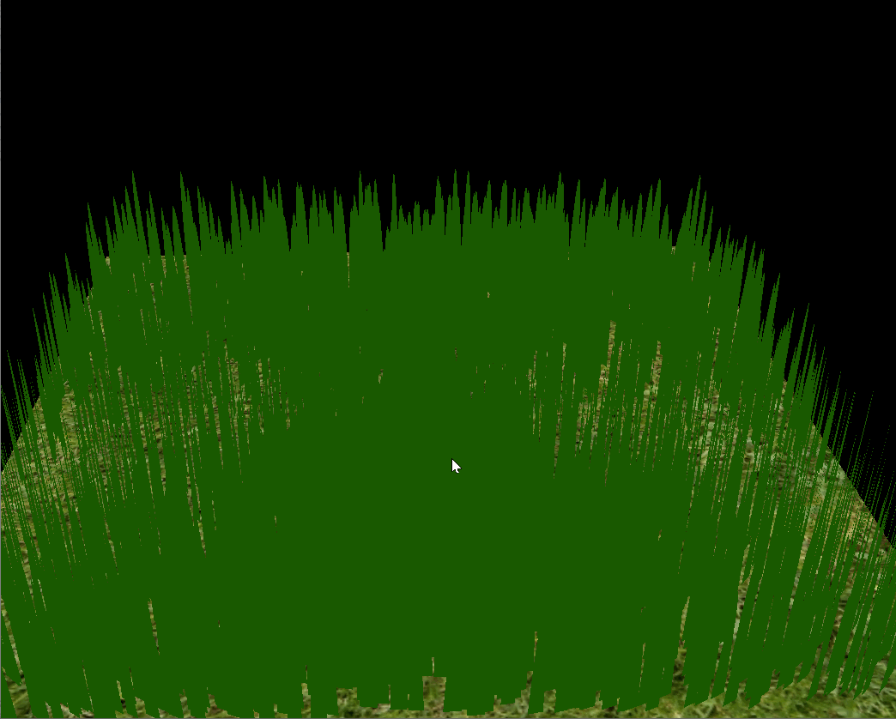

Vulkan Grass Rendering
==================================

**University of Pennsylvania, CIS 565: GPU Programming and Architecture, Project 5**

* Annie Qiu
   * [LinkedIn](https://github.com/AnnieQiuuu/Project0-Getting-Started/blob/main/www.linkedin.com/in/annie-qiu-30531921a)
* Tested on: Windows 11, i9-12900H @2500 Mhz, 16GB, RTX 3070 Ti 8GB (Personal)

## Overview
This project is an implementation of the paper, [Responsive Real-Time Grass Rendering for General 3D Scenes](https://www.cg.tuwien.ac.at/research/publications/2017/JAHRMANN-2017-RRTG/JAHRMANN-2017-RRTG-draft.pdf). In this project, I use Vulkan to implement a grass simulator and renderer.The compute shaders are used to perform physics calculations on Bezier curves that represent individual grass blades in your application. Since rendering every grass blade on every frame will is fairly inefficient, you will also use compute shaders to cull grass blades that don't contribute to a given frame. The remaining blades will be passed to a graphics pipeline, in which you will write several shaders. 

### Features
- Simulating Forces
    - Binding Resources
    - Gravity
    - Recovery
    - Wind
- Culling tests
    - Orientation culling
    - View-frustum culling
    - Distance culling
- Tessellating Bezier curves into grass blades
- Tessellate to varying levels of detail

## Screenshot

### Simulating Forces
This section explains how forces are simulated on grass blades that represented as Bezier curves within a compute shader.

#### Gracity only

#### Recovery only

#### Wind only

### Culling tests
To improve the efficiency, I cull the blades that may not require rendering. You can set `#define FrustumCulling 1`, `#define DistanceCulling 1` and `#define OrientationCulling 1` to 1 or 0 to check different culling techniques in compute.comp.

#### Orientation culling

#### View-frustum culling

#### Distance culling

## Performance Analysis

### Culling chart

The chart shows the performance of a grass rendering system measured in frames per second (FPS) as the number of grass blades decreased. The lower the FPS is, the better the performace.The chart compares different culling strategies:
    - blue block: Original (no culling)
    - red block: Frustum Culling
    - yellow block: Distance Culling
    - freeb block: Orientation Culling
    - All Culling (combination of all three)
- X aixs: the number of blades from 2^18 to 2^8
- Y aixs: FPS
As the number of blades increases, the FPS goes down in all the situations. Frustum Culling improves the performance a lot, particularly noticeable with higher blade counts, as a large amount of blades outside the view are ignored. Distance culling improves a lot when the distance get further, as blades further than some certains of the threshold are ignored. Orientation culling imporves moderately by ignoring blades oriented away from viewer. The All culling (combination of all three strategies) improves the performance most. It demonstrates the compounded benefits of combingnni culling techniques.

### Dyamic Tessellation Level

The chart shows the impact of dynamic tessellation levels on rendering performance measured in frames per second (FPS) as the number of grass blades decreased. It compares dynamic On and dynamic Off scenarios:
- X aixs: the number of blades from 2^18 to 2^8
- Y aixs: FPS
Enabling dynamic tessellation level of details significantly improves FPS, especially with higher numbers of grass blades. Tessellation reduces detail for distant grass blades, optimizing rendering performance.

## Resources
[helloTessellation sample](https://github.com/CIS565-Fall-2017/Vulkan-Samples/tree/master/samples/5_helloTessellation)
[tutorial on tessellation](https://ogldev.org/www/tutorial30/tutorial30.html)

